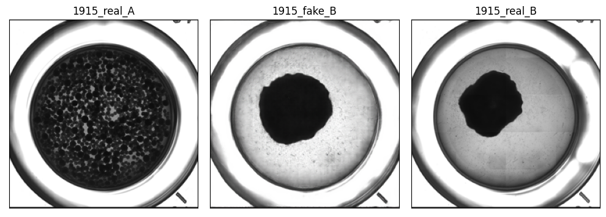

# Cell pix2pix


[ENG](README.md) [KOR](README_KOR.md)


Cell pix2pix is based on the [CycleGAN and pix2pix in PyTorch](https://github.com/junyanz/pytorch-CycleGAN-and-pix2pix).

Microblocks are initially present (‘before image’), and after a period of 72 hours (‘after image’), they have the possibility to either gather together or remain separate. When the microblocks successfully aggregate, they form a Tissue Module, indicating a success case. Conversely, if the microblocks fail to aggregate, it is categorized as a failure case.

### Training and Test Images

- o_images_final example  


- x_images_final example


To create a suitable dataset, I cropped the before and after images to a size of 1456x1456 pixels. I then merged them side by side, resulting in a final image size of 2912x1456 pixels.


The training process was conducted separately for success and failure cases, resulting in two different checkpoints (o_300_epochs, x_300_epochs).

Download [checkpoint.tar](https://www.dropbox.com/s/3jr89k6njdmsq47/checkpoint.tar?dl=0) and untar it under the 'cells-pix2pix' folder. 

```
cells-pix2pix
└── checkpoint
    ├── o_300_epochs
    │   └── web
    │       └── images
    └── x_300_epochs
        └── web
            └── images
```


### test results

- o example


- x example


The objective of this task is to predict and generate the ‘after image’ based on the input of a ‘before image’ using Image-to-Image Translation.

The model takes the ‘before image’ as input, and depending on whether it is a success or failure case, a specific checkpoint is used to generate the appropriate output


## Prerequisites
- Linux or macOS
- Python 3
- CPU or NVIDIA GPU + CUDA CuDNN


## train/test
```
cells-pix2pix
└── cell_images
    ├── o_images_final
    │   ├── test
    │   ├── train
    │   └── val
    └── x_images_final
        ├── test
        ├── train
        └── val

```

|        |  o_images_final  |  x_images_final |  
|-------:|:----------------:|----------------:|  
|  train |       548        |             487 |  
|    val |        69        |              61 |  
|   test |        69        |              61 |

-   To view training results and loss plots, run `python -m visdom.server` and click the URL [http://localhost:8097](http://localhost:8097/).
- Train a model:
```bash
python train.py --dataroot ./cell_images/o_images_final --name o_300_epochs --n_epochs 300 --n_epochs_decay 0 --model pix2pix --direction AtoB --gpu_ids 2
```

```bash
python train.py --dataroot ./cell_images/x_images_final --name x_300_epochs --n_epochs 300 --n_epochs_decay 0 --model pix2pix --direction AtoB --gpu_ids 2
```
- To see more intermediate results, check out  `./checkpoints/o_300_epochs/web/index.html`.
- Jupyter notebook users can also visualize the results by running the 'checkpoint_display_img.ipynb' file. 
- To remove all '.pth' files except for the latest ones after the training is complete, you can refer to the 'delete_pth_file.ipynb' file.


- Test the model:
```bash
python test.py --dataroot ./cell_images/o_images_final --name o_300_epochs --model pix2pix --direction AtoB --gpu_ids 2
```

```bash
python test.py --dataroot ./cell_images/x_images_final --name x_300_epochs --model pix2pix --direction AtoB --gpu_ids 2
```
- The test results will be saved to a html file here: `./results/o_300_epochs/test_latest/index.html`. You can find more scripts at `scripts` directory.
- Jupyter notebook users can also visualize the results by running the 'test_display_img.ipynb' file.


## Citation
**CycleGAN: [Project](https://junyanz.github.io/CycleGAN/) | [Paper](https://arxiv.org/pdf/1703.10593.pdf) **

**Pix2pix: [Project](https://phillipi.github.io/pix2pix/) | [Paper](https://arxiv.org/pdf/1611.07004.pdf) **

Unpaired Image-to-Image Translation using Cycle-Consistent Adversarial Networks.  
[Jun-Yan Zhu](https://www.cs.cmu.edu/~junyanz/)*, [Taesung Park](https://taesung.me/)*, [Phillip Isola](https://people.eecs.berkeley.edu/~isola/), [Alexei A. Efros](https://people.eecs.berkeley.edu/~efros). In ICCV 2017. (* equal contributions) [[Bibtex]](https://junyanz.github.io/CycleGAN/CycleGAN.txt)

Image-to-Image Translation with Conditional Adversarial Networks.  
[Phillip Isola](https://people.eecs.berkeley.edu/~isola), [Jun-Yan Zhu](https://www.cs.cmu.edu/~junyanz/), [Tinghui Zhou](https://people.eecs.berkeley.edu/~tinghuiz), [Alexei A. Efros](https://people.eecs.berkeley.edu/~efros). In CVPR 2017. [[Bibtex]](https://www.cs.cmu.edu/~junyanz/projects/pix2pix/pix2pix.bib)
```
@inproceedings{CycleGAN2017,
  title={Unpaired Image-to-Image Translation using Cycle-Consistent Adversarial Networks},
  author={Zhu, Jun-Yan and Park, Taesung and Isola, Phillip and Efros, Alexei A},
  booktitle={Computer Vision (ICCV), 2017 IEEE International Conference on},
  year={2017}
}


@inproceedings{isola2017image,
  title={Image-to-Image Translation with Conditional Adversarial Networks},
  author={Isola, Phillip and Zhu, Jun-Yan and Zhou, Tinghui and Efros, Alexei A},
  booktitle={Computer Vision and Pattern Recognition (CVPR), 2017 IEEE Conference on},
  year={2017}
}
```
